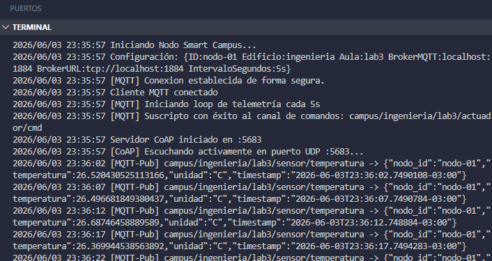

# Nodo IoT Smart Campus

Proyecto para la **Parte A** de la Práctica Guiada 2: comunicación **MQTT + CoAP**.

## Integrantes

- Martinez Lazaro Ezequiel
- Mendoza Guadalupe Maira

---

## Descripción

Este proyecto implementa un **nodo IoT simulado** para un campus inteligente. El nodo:

1. Se conecta a un broker MQTT (NanoMQ) con testamento (LWT) para reportar su estado online/offline.
2. Publica periódicamente lecturas de temperatura simuladas.
3. Se suscribe a un tópico de comandos para recibir acciones sobre actuadores.
4. Expone un servidor CoAP (sobre UDP) para consultar la última temperatura y la configuración del nodo vía REST.

---

## Estructura del proyecto

```
ParteA/
├── cmd/nodo/main.go          # Punto de entrada principal
├── pkg/
│   ├── coap/servidor.go      # Servidor CoAP (GET /temperatura, GET/PUT /config)
│   ├── mqtt/cliente.go       # Cliente MQTT con LWT, publicación y suscripción
│   ├── nodo/config.go        # Carga de configuración desde variables de entorno
│   └── sensor/simulador.go   # Simulador de lecturas de temperatura
├── Dockerfile                # Imagen Docker multi-stage para el nodo
├── docker-compose.yml        # Orquestación: broker NanoMQ + nodos
└── Makefile                  # Comandos de conveniencia
```

---

## Ejecución

### Requisitos previos

- **Docker** y **Docker Compose** instalados.
- (Opcional para ejecución local) **Go 1.22+** y un broker MQTT en `localhost:1883`.

### Docker Compose (modo recomendado)

**1. Levantar el broker NanoMQ** (en background):
```bash
make broker-up
```

**2. Lanzar nodos** (en terminales separadas):
```bash
# Terminal 2: Nodo 1
make docker-nodo1

# Terminal 3: Nodo 2
make docker-nodo2
```

**3. Ver logs del broker y nodos**:
```bash
make docker-logs
```

**4. Detener todo**:
```bash
make broker-down
```

### Ejecución local

Requisito: broker MQTT corriendo en `localhost:1883`.

```bash
# Terminal 1: Broker (si no hay uno local)
make broker-up

# Terminal 2: Nodo
make run
```

---

## Variables de entorno

| Variable             | Default          | Descripción                            |
| -------------------- | ---------------- | -------------------------------------- |
| `NODO_ID`            | `nodo-01`        | Identificador único del nodo           |
| `NODO_EDIFICIO`      | `ingenieria`     | Nombre del edificio                    |
| `NODO_AULA`          | `lab3`           | Nombre del aula                        |
| `MQTT_BROKER`        | `localhost:1884` | Dirección del broker MQTT              |
| `INTERVALO_SEGUNDOS` | `5`              | Segundos entre lecturas de temperatura |

---

## Requisitos completados

- [x] Cliente MQTT con testamento (LWT): `nodo/{id}/estado` → `{"estado":"offline"}`
- [x] Publicar estado `{"estado":"online"}` retenido tras conectar
- [x] Loop de lecturas simuladas cada 5s en `campus/{edificio}/{aula}/sensor/temperatura` con QoS 1
- [x] Suscripción a comandos en `campus/{edificio}/{aula}/actuador/cmd` con acción impresa
- [x] Servidor CoAP con recursos:
  - [x] `GET /temperatura` → última lectura en JSON
  - [x] `PUT /config` → actualizar configuración local
  - [x] `GET /config` → configuración actual en JSON
- [x] Docker Compose con al menos 1 nodo + NanoMQ broker

---

## Captura de ejecución

A continuación se muestra la ejecución del nodo IoT, donde se puede observar:
- La conexión exitosa al broker MQTT
- La publicación periódica de lecturas de temperatura en el tópico `campus/ingenieria/lab3/sensor/temperatura`
- El servidor CoAP escuchando en el puerto UDP 5683
- Los mensajes JSON con `nodo_id`, `temperatura`, `unidad` y `timestamp`


