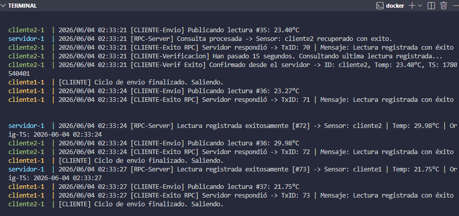

# Servicio de Telemetría con Detección de Fallos

Proyecto para la **Parte B** de la Práctica Guiada 2: **RPC**, reintentos y detección de fallos.

## Integrantes

- Martinez Lazaro Ezequiel
- Mendoza Guadalupe Maira

---

## Descripción

Este proyecto implementa un **sistema de telemetría distribuido** con:

1. **Servidor RPC** (sobre `net/rpc` de Go) que expone los métodos `RegistrarLectura` y `ObtenerUltimaLectura` para recibir y consultar datos de sensores.
2. **Clientes RPC** que envían periódicamente lecturas de temperatura simuladas al servidor y consultan la última lectura registrada.
3. **Heartbeat UDP** enviado por el servidor a todos los clientes registrados. Los clientes detectan el estado del servidor mediante timeouts con transiciones de estado: `alive` → `suspect` → `dead`.
4. **Protocolo JSON** en todos los mensajes intercambiados (structs con tags `json`).

**Flujo del Heartbeat:**
- El servidor envía heartbeats UDP periódicos a cada cliente.
- El cliente monitorea la recepción y calcula el tiempo de inactividad.
- Si no recibe heartbeat en un período (`timeout`): estado → `suspect`.
- Si supera el doble del timeout: estado → `dead`.
- Si se recupera la recepción: estado → `alive`.

---

## Estructura del proyecto

```
ParteB/
├── cmd/
│   ├── servidor/main.go      # Punto de entrada del servidor RPC + Heartbeat
│   └── cliente/main.go       # Punto de entrada del cliente RPC + detector
├── internal/
│   └── detector/heartbeat.go # Enviador y Receptor de heartbeats UDP
├── pkg/
│   ├── protocolo/mensaje.go  # Structs del protocolo: Heartbeat, Lectura, etc.
│   └── telemetria/servicio.go# Servicio RPC: RegistrarLectura, ObtenerUltimaLectura
├── Dockerfile.servidor       # Imagen Docker del servidor
├── Dockerfile.cliente        # Imagen Docker del cliente
├── docker-compose.yml        # Orquestación: servidor + 2 clientes
└── Makefile                  # Comandos de conveniencia
```

---

## Ejecución

### Requisitos previos

- **Docker** y **Docker Compose** instalados.
- (Opcional para ejecución local) **Go 1.22+**.

### Docker Compose (modo recomendado)

**1. Levantar el servidor** (en background):
```bash
make docker-up
```

**2. Conectar clientes** (en terminales separadas):
```bash
# Terminal 2: Cliente 1
make docker-cliente1

# Terminal 3: Cliente 2
make docker-cliente2
```

**3. Ver logs del servidor**:
```bash
make docker-logs
```

**4. Detener todo**:
```bash
make docker-down
```

### Ejecución local

```bash
# Terminal 1: Servidor
make run-servidor

# Terminal 2: Cliente 1
NOMBRE=cliente-a SERVIDOR=localhost:1234 make run-cliente

# Terminal 3: Cliente 2
NOMBRE=cliente-b SERVIDOR=localhost:1234 make run-cliente
```

---

## Variables de entorno

### Servidor

| Variable            | Default      | Descripción                                       |
| ------------------- | ------------ | ------------------------------------------------- |
| `RPC_PUERTO`        | `:1234`      | Puerto TCP para el servicio RPC                   |
| `HEARTBEAT_PUERTO`  | `:4001`      | Puerto UDP para enviar heartbeats                 |
| `HEARTBEAT_DESTINO` | `""`         | Destinos UDP de los clientes (separados por coma) |
| `NODO_ID`           | `servidor-1` | Identificador del nodo servidor                   |

### Cliente

| Variable           | Default         | Descripción                        |
| ------------------ | --------------- | ---------------------------------- |
| `SERVIDOR`         | `servidor:1234` | Dirección del servidor RPC         |
| `NOMBRE`           | `cliente-1`     | Nombre identificador del cliente   |
| `HEARTBEAT_PUERTO` | `:4002`         | Puerto UDP para recibir heartbeats |

---

## Requisitos completados

- [x] Servidor RPC con métodos `RegistrarLectura` y `ObtenerUltimaLectura`
- [x] Protocolo JSON en todos los mensajes (structs con tags `json`)
- [x] Cliente RPC con loop automático de lecturas
- [x] Heartbeat UDP: servidor envía, cliente detecta timeout con estados `alive`/`suspect`/`dead`
- [x] Docker Compose con al menos 1 servidor + 2 clientes

---

## Captura de ejecución

A continuación se muestra la ejecución del sistema completo, donde se puede observar:
- **Servidor** registrando lecturas exitosamente con IDs incrementales (`[RPC-Server] Lectura registrada exitosamente [#72]`)
- **Cliente 1 y Cliente 2** enviando lecturas de temperatura y recibiendo confirmación del servidor
- Consultas de la última lectura registrada desde los clientes (`ObtenerUltimaLectura`)
- Ciclos de envío finalizando correctamente en ambos clientes


